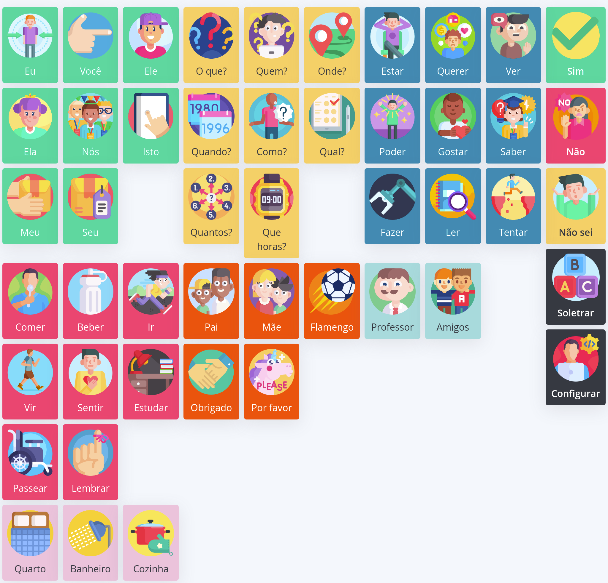

#  Prancha Comunicadora  Digital

###  

- [Descrição](#descricao)
- [Objetivo](#objetivo)
- [Funcionalidades](#funcionalidades)
- [Desenho](#funcionalidades)
- [Versão Final](#versão-final)
- [Publicações](#publicações)

## Descrição
Protótipo de prancha comunicadora digital para uso de pessoas com mobilidade reduzida.

O projeto está sendo construído e concebido pelos meus alunos do integrado em Informática para Internet.

## Objetivo
Este protótipo busca praticar os conceitos de Vanilla JS, HTML e CSS para gerência de dados dentro de um navegador.

O projeto final será implementado com tecnologias mais robustas como React Native e com back-end em NodeJS.

## Funcionalidades
O projeto pretende implementar uma versão digital editável de uma prancha comunicadora como a exibida na imagem abaixo.



Adicionalmente, pretendemos adicionar umas funcionalidades extras para escrita de textos avulsos, como na imagem abaixo.


Outra funcionalidade importante neste projeto é o conceito de categorias que é expresso por meio de cores na primeira imagem. As categorias vão nos ajudar a exibir e/ou esconder parte do conteúdo.

Adicionalmente, quando usando navegadores modernos, usaremos as bibliotecas de voz para facilitar ainda mais a comunicação e um campo de formação de frases mistas com símbolos.

Por fim, a adição de termos/símbolos será a principal característica da prancha.

## Desenho
Este protótipo será desenhado para dispositivos menores como tablets e celulares pois é voltado para um caso real existente do campus.

## Versão final
A versão final do protótipo é utilizável e será disponibilizada em https://vauxgomes.github.io/pranchacomunicadora e pode ser usada por qualquer pessoa com acesso à internet.

## Publicações
_Uso de tecnologia assitiva para construção de uma prancha comunicadora digital, 2021, Vaux Gomes._

### Bibtex
Caso utilize este projeto, por favor citar:

```bibtex
@misc{vaux2021pranchacomunicadora,
    author = "{Vaux Sandino Diniz Gomes}",
    title = {Uso de tecnologia assitiva para construção de uma prancha comunicadora digital},
    howpublished = {\url{https://vauxgomes.github.io/pranchacomunicadora}},
    note = {Online; acesso em 2021} ,
    year=2021,
}
```

### Publicações relacionadas
Publicações relacionadas a este projeto, ordenadas por data de publicação.

|Data|Artigo (Link)|
|:-|:-|
|-|-|